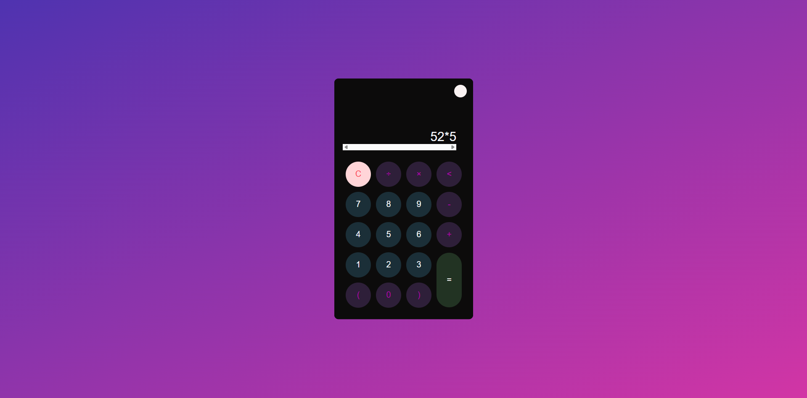

# 🧮 Dark/Light Mode Calculator

A modern, responsive calculator web application with **dark and light theme toggle** functionality.  
Built using **HTML**, **CSS**, and **JavaScript**, this calculator supports basic arithmetic operations with a clean UI and smooth animations.

---

## 📌 Features

- **Basic operations**: Addition, subtraction, multiplication, and division
- **Clear (C)** button to reset display
- **Backspace** functionality to remove last digit
- **Bracket support**: `(` and `)` for expressions
- **Dark/Light theme toggle**
- **Responsive design** for all screen sizes
- **Smooth hover animations** on buttons

---

## 🛠️ Technologies Used

- **HTML5** — Structure of the calculator
- **CSS3** — Styling, animations, dark/light themes
- **JavaScript (Vanilla)** — Functional logic and event handling

---

## 📷 Screenshots

_(Replace with your actual screenshot)_


2.png

---

## 🚀 Getting Started

### 1️⃣ Clone the Repository

```bash
git clone https://github.com/Dibyajyoti03/Calculator.git
```

### 2️⃣ Navigate to the Project Directory

```bash
cd Calculator
```

### 3️⃣ Open in Browser

Simply open the `index.html` file in your preferred browser:

```bash
start index.html   # Windows
open index.html    # macOS
```

---

## 📂 Project Structure

```
Calculator/
│-- index.html       # Main HTML structure
│-- style.css        # Styling for calculator and themes
│-- script.js        # JavaScript logic
│-- README.md        # Documentation file
```

---

## 🔮 Future Improvements

- Add keyboard input support
- Improve mobile touch handling
- Add percentage and square root operations
- Display calculation history

---

## 📜 License

---

### ✅ Also create a `LICENSE` file

Add a file named `LICENSE` in your repo root with the MIT License text:

```text
MIT License

Copyright (c) 2025 Dimo003dj

Permission is hereby granted, free of charge, to any person obtaining a copy
of this software and associated documentation files (the "Software"), to deal
in the Software without restriction, including without limitation the rights
to use, copy, modify, merge, publish, distribute, sublicense, and/or sell
copies of the Software, and to permit persons to whom the Software is
furnished to do so, subject to the following conditions:

[... rest of MIT license text ...]


---

## 👨‍💻 Author

**Dibyajyoti Mohanty**
📧 Email: dibyajyotimty508@gmail.com
GitHub: [@Dibyajyoti03](https://github.com/Dibyajyoti03)
```
